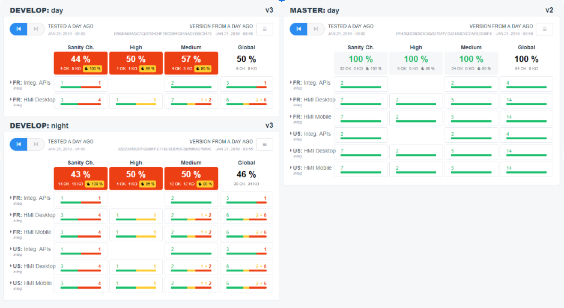
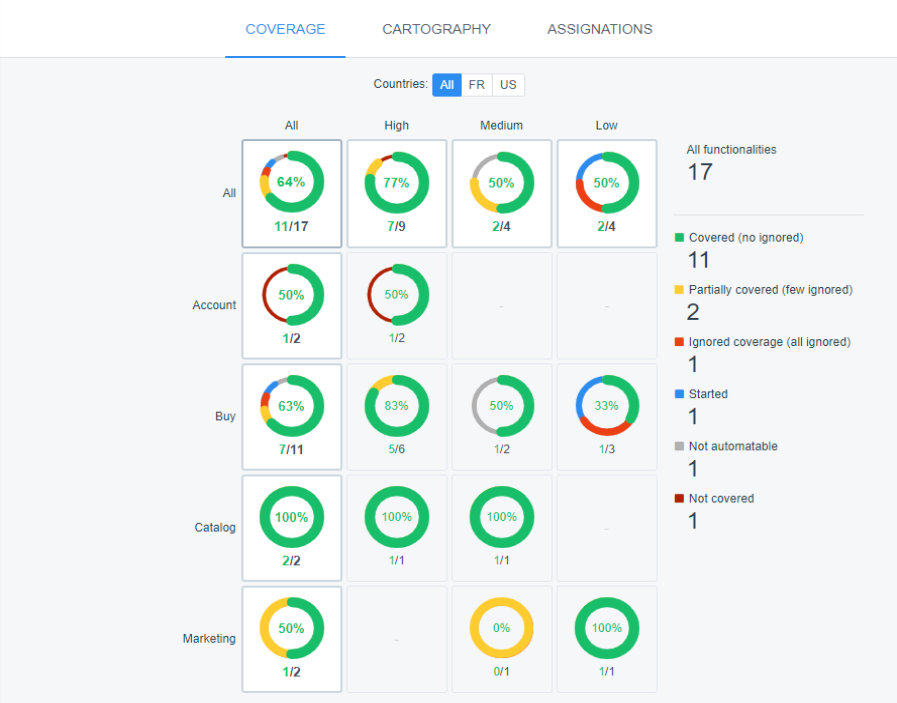
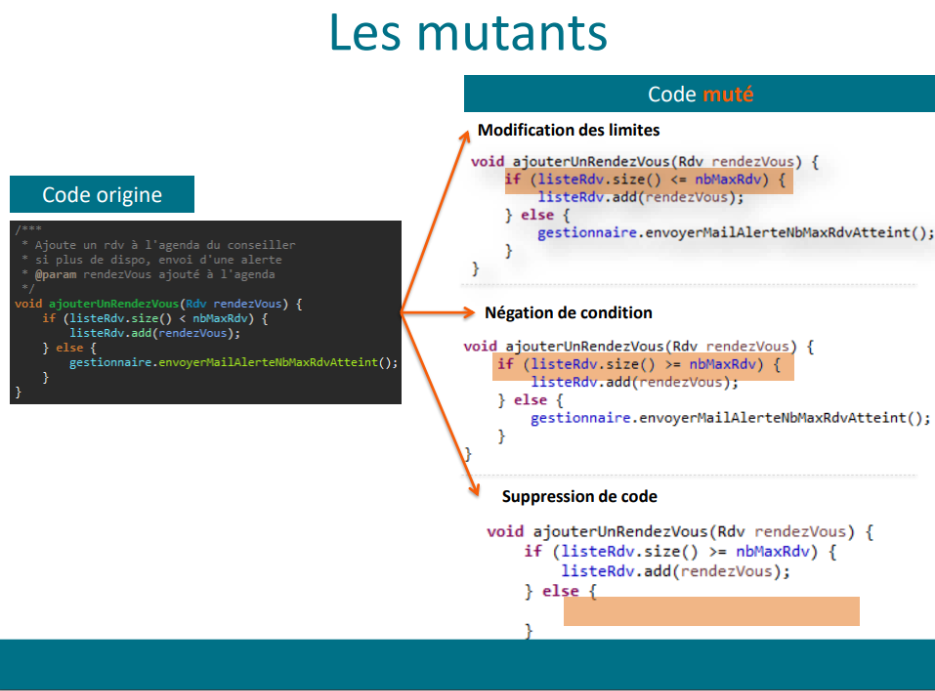

Le 09 avril dernier, nous avons eu la chance de participer à la 11ème édition de la Journée Française des tests logiciels,  événement annuel organisé par le comité Français des tests Logiciels. 

La **JFTL2019** s’est déroulée cette année au Beffroi de Montrouge à Paris et a regroupé près de **1200 acteurs du test**. Cet événement est avant tout un lieu d’échanges, de rencontres et permet aux différents conférenciers de donner leurs retours d’expériences sur les stratégies et outils mis en places au sein de leurs structures respectives. 

La journée s’est ouverte avec les résultats de l’ [enquête réalisée par le CFTL](http://www.cftl.fr/wp-content/uploads/2019/04/JFTL-2019-Enqu%C3%AAte-CFTL-2019.pdf) basée sur les différentes pratiques et les changements organisationnels dans le domaine du test depuis 2017.  Sans grande surprise, c’est une transformation avec l’agilité au coeur qui s’est opérée. Elle s’est principalement traduit au niveau de l’utilisation d’une approche agile (Scrum, Kanban, SAFe…) par les équipes, l’intégration du testeur au sein des équipes projets ainsi que de la mise en oeuvre des tests dans une démarche d’intégration continue.

Après cette belle mise en contexte, nous avons pu assister à de très belles présentations. Nous avons donc décidé d’en présenter 3 qui nous ont particulièrement marquées. 

## Le facilitateur naturel du continuous testing chez Decathlon - automatisés:

Cette conférence était avant tout une présentation d’un nouvel outil développé par les équipes de Decathlon. Les deux speakers ont démarré par un retour d’expériences sur leur méthodologie de tests et les limites qu’ils ont rencontrées. En effet au fil des années, ils ont implémenté des centaines de cas de tests aux typologies différentes (Tests unitaires, tests d’api etc…). Ces derniers s’exécutent plusieurs fois par jours. Cela représente alors une masse conséquente de résultats de tests à agréger et à analyser. C’est donc pour ces raisons que les équipes de Decathlon se sont lancées dans la recherche d’un outil capable de répondre à leur besoin. Après plusieurs POC d’outils disponibles sur le marché, aucuns ne répondaient exactement à leur besoin. Ils ont donc démarré les développements de l’outil nommé ARA : Agile Regression Analyser.

ARA est une application web qui permet d’agréger les résultats. Les systèmes de tests type postman ou cucumber peuvent envoyer leurs données de tests à ARA. Ce dernier se charge alors d’afficher les rapports détaillés des exécutions et facilite la création de defect en cas de bug.
Une autre fonctionnalité intéressante du nouvel outil de Decathon est la couverture de tests par fonction des application testées. L’outil permet de cartographier les fonctions des applications et de lister les tests liés à ces fonctions. On peut ensuite consulter la couverture de tests sur un autre dashboard. Ici aussi les écrans semblaient très intuitifs et complets.Pour cette première conférence de la journée Décathlon nous a présenté un outil très intéressant qui est de plus open source. Voici le lien vers [ARA](https://github.com/Decathlon/ara)

<p align="center">
  
</p>


<p align="center">
  
</p>

## Comment échouer dans l’adoption de l’approche Behavior Driven Development

Pour cette présentation, un consultant expert en test est venu nous présenter un retour d’expériences concernant le BDD (Behavior Driven Development). Après un bref rappel sur les principes de la méthodologie en question, il a abordé les erreurs les plus courantes lors de l’adoption du BDD et comment les éviter.
Voici les conseils que j’ai retenus pour faciliter l’adoption de la méthode BDD.
Cette approche est longue et coûteuse à mettre en place, il faut savoir estimer le temps de la mise en place et ne pas vouloir aller trop vite. Le ROI ne sera pas immédiat.
Pour démarrer le BDD, choisissez une équipe pilote, qui pour ensuite accompagner les autres équipes dans cette nouvelle démarche.
Une des erreurs les plus courantes est l’écriture des scénarios gherkin par un développeur, les scénarii doivent être compréhensibles par tous les acteurs de la feature, or quand c’est le développeur qui se charge de l’écriture, on perd alors le côté fonctionnel. 
Pour éviter tout problème de version de documentation, les tests et la documentation doivent être placés dans le code l’application testée.
La collaboration des équipes est également importante, le conférencier a souligné le fait que les 3 amigos (le product owner, le développeur et le tester) doivent être présents pour réaliser des scénarii.

## Au-delà de la couverture de code, comment s’assurer que nos tests unitaires sont pertinents

Cette conférence présentée par Pôle Emploi s’est déroulée dans une petite salle pouvant accueillir près de 50 personnes. Il semble que les organisateurs ne pensaient pas que cette conférence séduirait la communauté du test... C’est contre toute attente que les sièges se sont remplis et que les personnes se sont accolées aux murs tel l'intérêt était réel. 

La présentation a commencé par une brève définition des tests unitaires, leur place dans la stratégie actuelle de testing chez Pôle Emploi et par ailleurs, la confiance qu’ils leurs accordent. 

Si cette confiance est si importante, c’est qu’un KPI est au centre de celle-ci : **Le taux de couverture** du code. Indicateur basé sur la quantité de TU et non sur leur qualité.  C’est suite à cela que les conférenciers sont rentrés dans le coeur du sujet : Comment rendre le **taux de couverture** comme étant un **KPI qualitatif** ? 

Ils ont donc présenté les **tests de mutation** ou **mutation testing** comme étant la réponse à cette question parmi les 3 axes suivant : 

### Qu’est-ce qu’un test de mutation ? 

L’objectif principal des tests de mutation est bel et bien de tester ses tests unitaires. Fonctionnellement parlant, il s’agit d’une dépendance attachée au projet qui viendra modifier les tests unitaires afin de les faires échouer. 

<p align="center">
  
</p>


Si les tests unitaires échouent, c’est qu’une partie du code est réellement testée et que le test est pertinent. Dans le cas contraire, si les tests passent, on peut en déduire que la partie du code n’est pas testée et que le test unitaire en question est à revoir. 

** C’est avec près de 20% de tests unitaires à revoir que Pôle Emploi ont validé leur POC. ** 

### Comment les mettre en place ?

Comme mentionné plus haut, il s’agit d’une simple dépendance à ajouter dans le code : 

```

<plugin>
    <groupId>org.pitest</groupId>
    <artifactId>pitest-maven</artifactId>
    <version>LATEST</version>
    <configuration>
        <targetClasses>
            <param>com.your.package.root.want.to.mutate*</param>
        </targetClasses>
        <targetTests>
            <param>com.your.package.root*</param>
        </targetTests>
    </configuration>
</plugin>

```
Le plugin [PiTest](http://pitest.org/) est dédié aux tests de mutations Java. Il à l’avantage de pouvoir être couplé à votre SONAR. 


Au dela de Java, il existe cependant des extensions pour tout type de technologies : 

- Ruby
- PHP
- Python
- Javascript
- … 

### Les limites des tests de mutation : 

- Le temps d’execution : 

Si toutes les options de mutations sont sélectionnées et appliquées au projet,  le temps d'exécution peut prendre entre 2h et 5h selon la taille du projet ainsi que de la couverture de test actuel.


- Le temps d’analyse : 

Le premier passage d’analyse des mutations peut être long et fastidieux. Il faut reprendre l’historique complet de tous les tests unitaires avant de pouvoir avancer et trouver son rythme de croisière. 

- Le risque de faux positifs : 

```

while(...){
 index++;
 if(index == 10)
 break;
}

```

Dans cet exemple, le changement d’opérateur ou mutation transformera le ‘==’ en ‘>=’. Ce qui produira le même résultat. Le test sera donc correct.


C’est donc sur une belle note que la *JFTL2019* s’est achevée et avec plaisir que nous y retournerons pour découvrir de nouvelles pratiques pour l’année 2020. Nous espérons pouvoir réaliser plusieurs POC dans nos missions respectives afin de mettre à l’épreuve nos nouvelles connaissances.